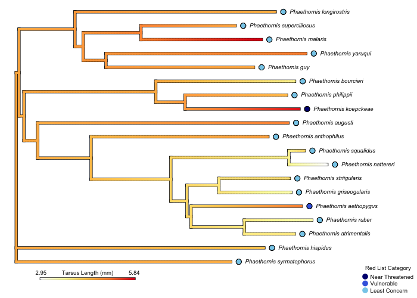

# Trait Evolution

Exploring the hypothesis that species with larger body sizes within a taxon are at a greater risk of extinction. This repo maps IUCN red list status onto a phylogenetic tree with body size comparisons.

The example looks at the hummingbird genus, Phaethornis. The MT-ND2 gene was used to construct the phylogenetic tree and tarsus length was used as a proxy for body size:

